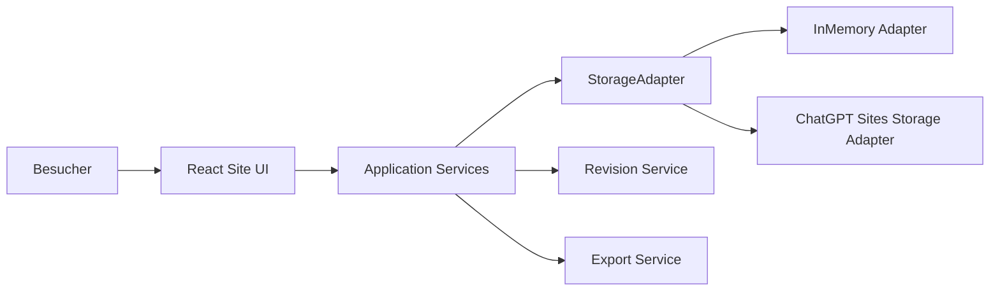

# Architektur

Prinzipien: Domain/ UI kennen keine konkrete Storage-Technologie; Validierung vor Persistenz; Mutationen zentral; Revision zusammen mit Mutation; runtime-spezifischer Code isoliert; keine erfundene D1/R2-API.
